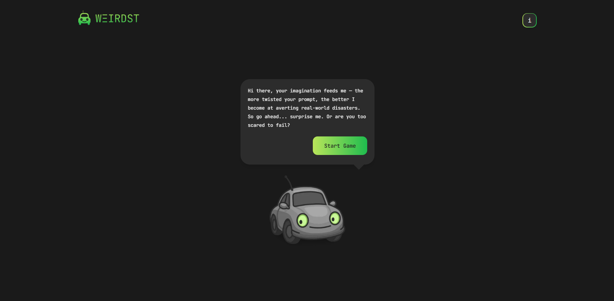
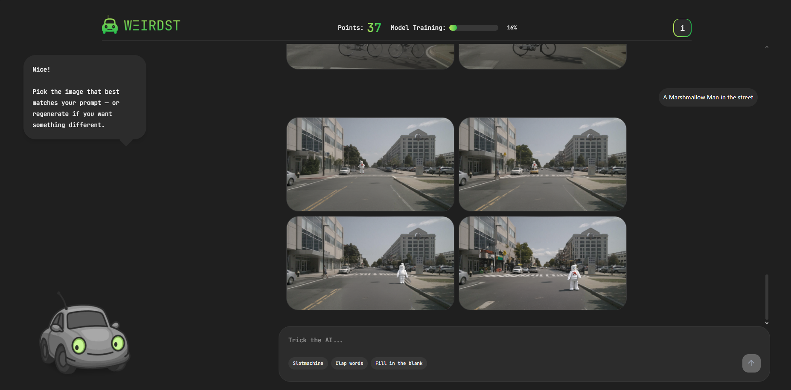
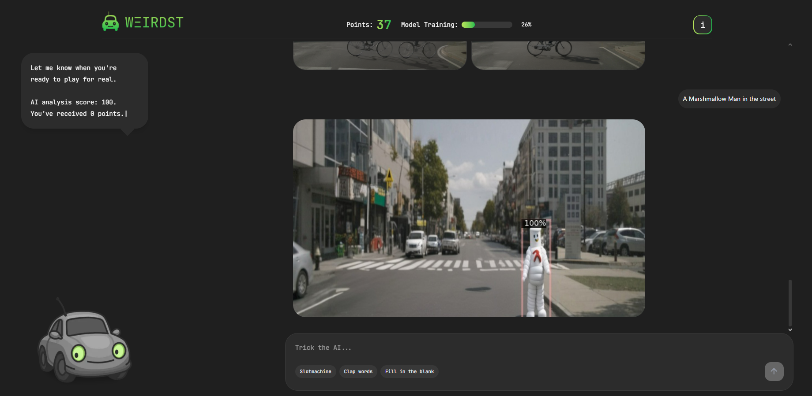

# Weird Stuff In Traffic - Frontend

This project contains the frontend part of a web application developed to visualize and analyze weird incidents in traffic. The project was bootstrapped with [Next.js](https://nextjs.org/) using [`create-next-app`](https://nextjs.org/docs/app/api-reference/cli/create-next-app).

## Getting Started

Follow the steps below to run the project in development mode:

1.  Navigate to the frontend folder from the repository's root directory:
    ```bash
    cd Weird-Stuff-In-Traffic/App/Frontend/weird-traffic-app
    ```
2.  Install the necessary packages (if not already installed):
    ```bash
    npm install
    # or
    yarn install
    # or
    pnpm install
    # or
    bun install
    ```
3.  Start the development server:
    ```bash
    npm run dev
    # or
    yarn dev
    # or
    pnpm dev
    # or
    bun dev
    ```

Open [http://localhost:3000](http://localhost:3000) in your browser to see the result.

## Screenshots

Here are a few screenshots of the application in action:


_Landing_


_Generation_


_Detection_

## 📁 Project Structure

weird-traffic-app/
├── .next/ # Build files generated by Next.js
├── node_modules/ # Project dependencies
├── public/ # Static assets (images, fonts, etc.)
│ └── car.png # car images
├── src/ # Application source code
│ ├── app/ # Next.js App Router files
│ │ ├── api/ # API routes
│ │ │ ├── detect/ # 🚦 Object/Similarity detection API
│ │ │ │ └── route.ts # Forwards request to the backend for detection
│ │ │ └── generate/ # 🚦 Image generation API
│ │ │ └── route.ts # Forwards request to the backend for image generation
│ │ ├── chat/ # client sided chat page
│ │ ├── components/ # Reusable React components
│ │ ├── constants/ # Constant values and configuration
│ │ ├── hooks/ # Custom React hooks
│ │ ├── stores/ # Zustand global stores
│ │ ├── types/ # TypeScript type definitions
│ │ ├── utils/ # Utility functions
│ │ ├── globals.css # Global styles with Tailwind directives
│ │ ├── layout.tsx # Root layout for the app
│ │ └── page.tsx # Main page component
├── .gitignore # Files and directories ignored by Git
├── eslint.config.mjs # ESLint configuration
├── next.config.ts # Next.js configuration
├── package.json # Project metadata and scripts
├── postcss.config.mjs # PostCSS configuration (used by Tailwind)
├── tailwind.config.ts # Tailwind CSS configuration
└── tsconfig.json # TypeScript configuration

### API Integration and User Interaction Flow

The frontend interacted with backend services via RESTful API endpoints exposed through Next.js API routes. Two primary endpoints were utilized: `/api/generate` for synthetic image generation and `/api/detect` for anomaly detection based on user input.

The `/api/generate` route accepted a user-provided textual prompt and returned an array of Base64 encoded images:

```typescript
// POST /api/generate

// Request body
const requestBody = {
  prompt: "textual prompt provided by the user",
};

// Type for a single generated image
export interface GeneratedImage {
  prompt: string;
  imageBase64: string;
}

// Response containing multiple generated images
export interface GeneratedImages {
  images: GeneratedImage[];
}
```

After image selection, the `/api/detect` endpoint was called with both the original prompt and the selected image. The response included a similarity score and a processed image, also Base64 encoded:

```typescript
// POST /api/detect

// Request body
const requestBody = {
  prompt: "Associated textual prompt",
  imageBase64: "...", //selectedImage
};

// Response type
type DetectApiResponse = {
  prompt: string;
  score: number;
  imageBase64: string; //detectedImage
};
```

## Learn More

To learn more about Next.js, take a look at the following resources:

- [Next.js Documentation](https://nextjs.org/docs) - learn about Next.js features and API.
- [Learn Next.js](https://nextjs.org/learn) - an interactive Next.js tutorial.

You can check out [the Next.js GitHub repository](https://github.com/vercel/next.js) - your feedback and contributions are welcome!

## Deploy on Vercel

The easiest way to deploy your Next.js app is to use the [Vercel Platform](https://vercel.com/new?utm_medium=default-template&filter=next.js&utm_source=create-next-app&utm_campaign=create-next-app-readme) from the creators of Next.js.

Check out our [Next.js deployment documentation](https://nextjs.org/docs/app/building-your-application/deploying) for more details.
